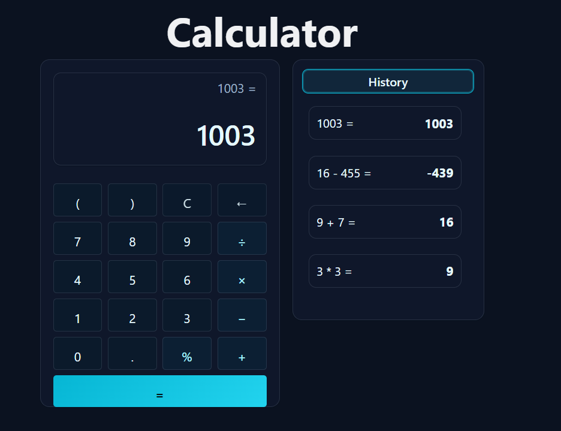

# A Simple Calculator

The app is here: https://hammer-hao.github.io/calculator/

## What is this

Calculator is a tiny full-stack demo: a Vue 3 (Vite) frontend talking to a Flask API. All math is evaluated on the server, so the UI stays thin and safe. It includes a keypad + keyboard input, a two-line display with auto-shrink, a dark/cyan theme, toast errors, and a loading spinner. The history sidebar is per-user (scoped by an X-Client-Id header) and stored in-memory on the server. 

## For devs

Run the Flask backend, then `npm i && npm run dev` in frontend and set `VITE_API_BASE` to your backend URL. For deploy: host the backend (e.g., Render) and the static frontend (e.g., GitHub Pages/Netlify/Vercel) with `VITE_API_BASE` pointing at the backend.

## Use of AI
This app was created using AI tools. Specifically, all of the AI assistance used are in this [single conversation](https://chatgpt.com/share/689a5476-b7d0-8009-aa4e-89697b300a63) with ChatGPT 5.

## Screenshot

